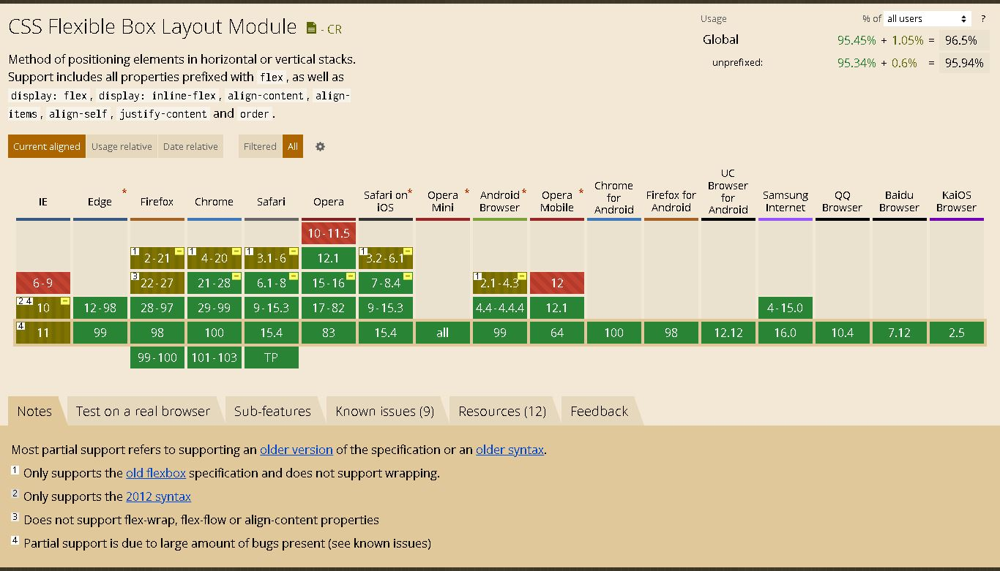

# TIL 2022-04-09

기존 복습 + 추가 공부

* * *

## Display의 flex 속성

* * *

- 뷰포트나 요소의 크기가 분명하지 않거나, 동적으로 변하는 것 상황에 맞춰 요소들을 효율적으로 배치, 정렬 등을 할 수 있는 CSS의 레이아웃 기능
- 큰 계산 없이 요소의 크기, 순서 등을 동적인 상황에 맞게 배치할 수 있음
- 유연하게 방향, 정렬 등 다양한 디자인적인 부분들을 조절할 수 있어 css만으로 많은 레이아웃을 구현하도록 해주는 가뭄의 단비같은 존재
- 옛날 flex와 grid가 없을때 table, inline-block, float 등을 통해 온갖 방법으로 가로/세로 정렬을 했으나.. flex와 grid의 등장으로 기존의 기능들은 거의 고대의 존재로 자리매김하게 됨 
- 1차원적인 레이아웃, 단방향 레이아웃, flexbox라고 불린다  
- 사용만 잘 하면 스스로 얼마나 빈 공간을 줄지 자동으로 계산해 배치되기 때문에 레이아웃계의 효자 그자체

<br>

> flex의 기본 개념      

1. flexbox는 flex-container, flex-item이라는 두 종류로 구성된다.
2. 원하는 요소들을 움직이고 싶다면, 그 요소들의 부모를 display: flex(또는 inline-flex)로 지정
3. 지정된 부모요소는 flex-container가 됨
      - flex라면 container박스(부모)가 블록 요소의 성향을 가짐(수직으로 한 줄 전체만 차지하려함)
      - inline-flex라면 container박스(부모)는 inline특성을 지니고 다른 요소들과 수평으로 쌓을 수 있음
        
        *__! 이는 부모 요소가 block / inline이 설정되는 것이지 부모 안 자식들은(item) 영향 없음__*

4. flex-container의 자식인 모든 요소들은 각각 flex-item으로 적용

5. item이 된 자식들은 모두 inline처럼 내용의 width공간만 차지, height는 부모 container의 높이만큼 늘어나게됨

6. 이후 container와 item에 각자 원하는 속성들을 추가로 부여하면 끝

<br/>

* * *

> flex-container 속성          

- 전체적인 기능들을 이용하려면 부모요소인 container에 속성을 넣어야 함
- 정렬, 방향, 방법 등 전체적 흐름 관련된 것은 container에서 지정, 자식의 크기/순서 등 세부적인 것은 자식 요소에서 적용

  <br/>

- container에 사용하는 속성들

```
flex-direction | flex-wrap | flex-flow | justify-content | align-items | align-content
```

1. flex-direction : 기본값은 row. Items(자식요소들)의 정렬 방향 설정

    + row: items를 왼쪽->오른쪽 수평 방향으로 정렬
    + row-reverse: items를 오른쪽->왼쪽 수평 방향으로 정렬
    + column: items를 위->아래 수직 방향으로 정렬
    + column-reverse: items를 아래->위 수직 방향으로 정렬

      *__! items가 배치되는 정렬 방향은 메인 축, 그의 반대되는 방향은 교차 축이 됨__*

    <br/>

2. flex-wrap : 기본값 nowrap. 줄바꿈 여부 설정. 

   + nowrap: 줄바꿈 안함. item이 넘치면 container를 삐져나게 됨(items 모두 1개의 줄에 넣기)
   + wrap: item 정렬 중 container의 크기가 부족하면 자동으로 줄바꿈 후 여러 줄에 정렬
   + wrap-reverse: 줄바꿈에서 items를 역순으로 배치

   <br/>

3. flex-flow : flex-direction과 flex-wrap을 함께 지정하는 속성.

    ```css
    .container { 
      flex-direction: row;
      flex-wrap: wrap;
      
      /* 위의 direction, wrap 속성 합쳐서 적용하기 */
      flex-flow: row wrap;
    }
    ```
   <br/>

4. justify-content : 메인 축의 정렬 방법 설정. flex-start가 기본값.

   + flex-start: items를 메인 축의 시작점부터 정렬(가로방향: 왼쪽부터, 세로방향: 위쪽부터)
   + flex-end: items를 메인 축의 끝점부터 정렬(가로방향: 오른쪽부터, 세로방향: 아래부터)
   + center: items 가운데로 정렬
   + space-between: 첫 item은 시작점, 끝의 item은 끝점, 나머지 Items는 그 사이 여백에 맞춰 균등하게 정렬
   + space-around: item의 둘레를 균등한 여백을 주고 정렬(item요소간 간격 == 양 끝 가장자리 여백의 2배)
   + space-evenly: items의 사이, 양 끝 가장자리까지 모두 균등한 간격으로 정렬

   <br/>

5. align-items : 메인 축의 반대방향(교차 축)에 대한 정렬 방법 설정. stretch가 기본값.

   + stretch: container(부모)의 높이만큼 교차축 방향으로 items를 늘어나게 만듦
   + flex-start: items를 시작점으로 정렬(가로방향: 위쪽부터, 세로방향: 왼쪽부터)
   + flex-end: items를 끝점으로 정렬(가로방향: 아래부터, 세로방향: 오른쪽부터)
   + center: items 가운데로 정렬
   + baseline: items를 글꼴의 기준선에 맞춰 정렬

   <br/>

6. align-content : item이 여러 줄 나열될 때, 메인 축의 반대방향(교차 축)에 대한 방향정렬. 기본값 stretch.
  
    *__! flex-wrap: nowrap__ 이 설정된 상태라면 적용되지 않으니 주의. (item이 여러 줄 이상이어야만 함)* 

   + stretch: container(부모)의 높이만큼 교차축 방향으로 item을 늘어나게 만듦
   + flex-start: items를 시작점으로 정렬
   + flex-end: items를 끝점으로 정렬
   + center: items 가운데로 정렬
   + space-between: 첫 item은 시작점, 끝 item은 끝점, 나머지 items는 그 사이 여백에 맞춰 균등하게 정렬
   + space-around: item의 둘레를 균등한 여백을 주고 정렬(item요소간 간격 == 양 끝 가장자리 여백의 2배)
   + space-evenly: items의 사이, 양 끝 가장자리까지 모두 균등한 간격으로 정렬

<br/>

* * *

> flex-item(s) 속성

- flex-container안에 있는 자식요소들의 크기/순서 등 세부적인 것은 자식 요소에서 적용해야 함
- 문서의 영향없이 내부 요소들의 순서를 변경하는 것은 이전 레이아웃 기법에서는 불가능했음
- flex-item의 속성

  ```
  order | flex-grow | flex-shrink | flex-basis | flex | align-self
  ```

1. order : 각 item의 시각적인 나열 순서를 설정. 기본값은 0.

     + 순서는 숫자로 설정
     + 숫자가 작을수록 앞으로 배치
     + 숫자가 클수록 뒤에 배치
     + 음수(-) 적용 가능
     + 시각적 순서일 뿐, html의 구조는 바뀌지 않음.
       
        __*!시각 장애인이 사용하는 스크린 리더가 읽을 때에는 order의 순서변경이 적용되지 않음*__ 
    
    <br/>

   * * * 

  > flex item의 order와 position의 z-index에 대해     

  + `order`

     - flex item의 order는 container(부모)안 자식요소들끼리 겹치지 않고 나란히 배치시키기 위한 것
     - order는 container와 item을 위해 존재하는 flex전용 z-index와 비슷한 느낌
     - order의 경우, z-index와 다르게 레이어 개념으로 구성하지 않음
     - order는 단지 요소의 흐름상 item이 어디에 나타나야 하는지 그 시각적인 위치만 결정하는 것
     - 즉 flex item의 order는 container안 요소들간의 순서 구분을 위한 것

  <br/>

  + `z-index` 

     - 기본적으로 z-index는 요소의 position이 기본값(static)이 아닌 경우에 작동하는 녀석
     - flex나 grid에 z-index를 적용하려면 먼저 자식요소들의 z-index가 기본값(auto)이 아니어야 한다
     - z-index가 auto가 아니어야 레이어 개념(stack context)이 생기기 때문
     - 이때 부모(container)의 형제요소에 position속성(static제외)을 주고, javascript로 item에 z-index값 추가시, 레이어 개념이 생긴 item들은 부모의 형제요소처럼 z-index가 적용되고, item들을 뒤에서부터 앞으로 올릴 수 있다
     - 이를 margin과 결합하면 레이아웃을 손쉽게 뷰포트화면 앞에 오게끔 만들고, 자동 정렬도 만들 수 있다

  > flex item과 z-index, margin을 잘 활용하면 item의 부모가 static속성을 가지고 있어도 item에 z-index를 넣어 앞으로 오게 만들 수 있고, 깔끔한 정렬도 가능하다 :D    
  >> *[flex, z-index, margin 활용하기](https://www.sitepoint.com/quick-tip-how-z-index-and-auto-margins-work-in-flexbox/)*

  <br/>
  
  * * *

2. flex-grow : container너비 기준으로 item의 확장 너비 비율 설정. 기본값 0.

     + 양수, 0 사용 
     + 단위값 없음
     + 숫자가 더 클수록 더 많은 너비 비율을 가짐

  - item이 flex-basis의 값보다 커져야 하는지를 결정하는 속성
  - 0이면 item이 container의 크기에 맞춰 늘어나지 않음
  - 1이상이면 원래 item의 크기에 관계없이 자동으로 container 기준으로 균등배분, 이에 맞춰서 item이 확장 

    __*!grow가 1이상이면 container너비 기준으로 확장하라는 의미이므로 width, basis에서 정의한 값이 무시될 수 있음*__ 

  <br/>

3. flex-shrink : container너비 기준 item의 감소 너비 비율 설정. 기본값 1.

      + 양수, 0 사용
      + 단위값 없음
      + 숫자가 더 클수록 더 많은 너비가 감소

  - item이 flex-basis의 값보다 작아져야 하는지를 결정하는 속성
  - 0이면 item이 감소되지 않으며, flex-basis보다 작아지지 않음
  - 1이상이면 item의 너비가 container보다 클 경우 자동으로 container 너비 기준으로 item이 균등하게 작아짐

  <br/>

4. flex-basis : 공간 배분 전(shrink, grow적용 전) item의 기본 크기 설정. 기본값 auto
       
     + 주축이 가로일 때: 너비로 적용, 주축이 세로일 때: 높이로 적용
     + px, em, cm등 단위값 명시 가능
     + 주로 auto, 0 많이 사용

  - items의 초기 크기를 설정하는 개념
  - item 넣기 전의 여유 공간을 설정하는 것
  - flex-basis로 공간 설정 후 남은 공간을 glow/shrink로 배분됨
  - 값이 auto면 item의 너비 기준으로 비율이 설정됨
  - auto상태라면 width, height속성 추가해서 원하는 크기 설정가능 
  - 값이 0이면 item은 container 크기 기준 동일한 비율로 나눠져서 적용됨(width, heigh설정 무시됨)

  <br/>

5. flex : grow, shrink, basis를 순차적으로 한번에 설정하는 단축속성. 기본값 0 1 auto

      + 확장, 감소, 초기너비 속성의 순서를 그대로 지켜야함
      + 기본값은 0 1 auto로 적용되나, flex-basis값이 flex(단축속성)에서 생략되면 0으로 설정됨

        *! flex: 1; 또는 flex: 1 1;같이 앞의 속성들만 적용 시 basis는 0으로 적용돼 자동확장하니 주의*

  <br/>

6. align-self : 교차축의 item 방향 정렬 설정. 기본값 auto

     + auto: container(부모)로부터 align-items 설정을 상속받음
     + stretch: container(부모)의 높이만큼 교차축 방향으로 item을 늘어나게 만듦
     + flex-start: item을 시작점으로 정렬(가로방향: 위쪽부터, 세로방향: 왼쪽부터)
     + flex-end: item을 끝점으로 정렬(가로방향: 아래부터, 세로방향: 오른쪽부터)
     + center: item을 가운데로 정렬
     + baseline: item을 글꼴의 기준선에 맞춰 정렬

  - container의 align-items로 모든 items의 정렬이 설정된 후, 원하는 item만 다른 정렬을 사용할 때 사용
  - align-items보다 우선적용되기 때문에 item별 정렬 가능

<br/>

> 기타 주의사항

    *! flexbox 사용 전 호환성을 확인할 것*




* * *

> 참고자료

  - <https://developer.mozilla.org/en-US/docs/Learn/CSS/CSS_layout/Flexbox>
  - <https://developer.mozilla.org/en-US/docs/Web/CSS/CSS_Flexible_Box_Layout/Basic_Concepts_of_Flexbox>
  - <https://css-tricks.com/snippets/css/a-guide-to-flexbox/>
  - <https://www.w3.org/TR/css-flexbox-1/#abspos-items>
  - <https://www.sitepoint.com/quick-tip-how-z-index-and-auto-margins-work-in-flexbox/>
  - <https://studiomeal.com/archives/197>
  - <https://heropy.blog/2018/11/24/css-flexible-box/>
  - <https://webclub.tistory.com/628>
  - <https://www.biew.co.kr/entry/CSS-FlexFlexible-Box-%EA%B0%9C%EB%85%90-%EC%A0%95%EB%A6%AC>
  - <https://d2.naver.com/helloworld/8540176>